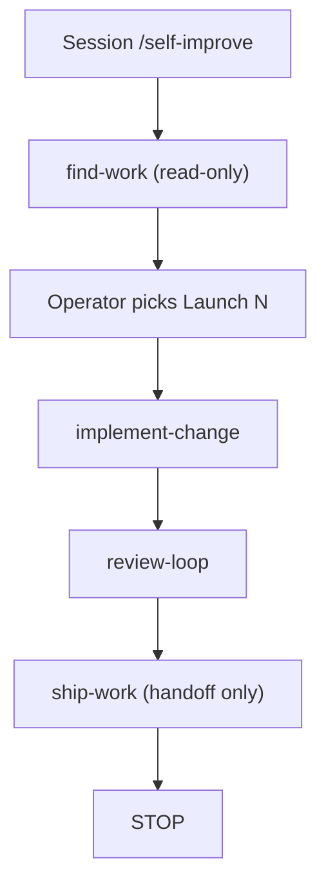

# Self-improve

One **light** lap: discover → pick (with operator) → implement → review →
handoff → **STOP**. All edits happen in the main checkout.

No autonomous PR merging, no overnight ship loops, no merge cleanup via
clock-out, no `watch-pr`. Git stays operator-owned:
[`.agents/rules/operator-owned-git.md`](../../rules/operator-owned-git.md).

Work sources: [`.agents/context/work-sources.md`](../../context/work-sources.md)
(incl. read-only `.shopping_list.json`).

## Lap



```
- [ ] 1. Run [`find-work`](../find-work/SKILL.md) (read-only)
- [ ] 2. Operator picks a launch brief (or names a task)
- [ ] 3. [`implement-change`](../implement-change/SKILL.md)
- [ ] 4. [`review-loop`](../review-loop/SKILL.md)
- [ ] 5. [`ship-work`](../ship-work/SKILL.md) handoff
- [ ] 6. STOP — do not loop, merge, or clock-out-merge-cleanup
```

Fuzzy briefs → [`alignment`](../alignment/SKILL.md), then stop for proceed.
Protected paths → confirm before editing.

## Picking

| Situation                        | Action                  |
| -------------------------------- | ----------------------- |
| Operator names Launch N / a task | Do that                 |
| Operator only ran find-work      | **Stop** after briefs   |
| Vague shopping-list title        | Alignment / scope first |
| Dedupe blocked or protected-path | **Stop**; surface why   |

Do **not** walk briefs autonomously into commit/PR. Do **not** start the next
find-work lap until the operator asks.

## Do not

- Commit, push, open PRs, or create branches
- Assume overnight Cursor Automations or merge cleanup
- Write `.shopping_list.json` or `.storage/`
- Treat `ship-work` as commit/push — it is handoff only
- Run `clock-out` as merge teardown (session wrap only, if asked)
