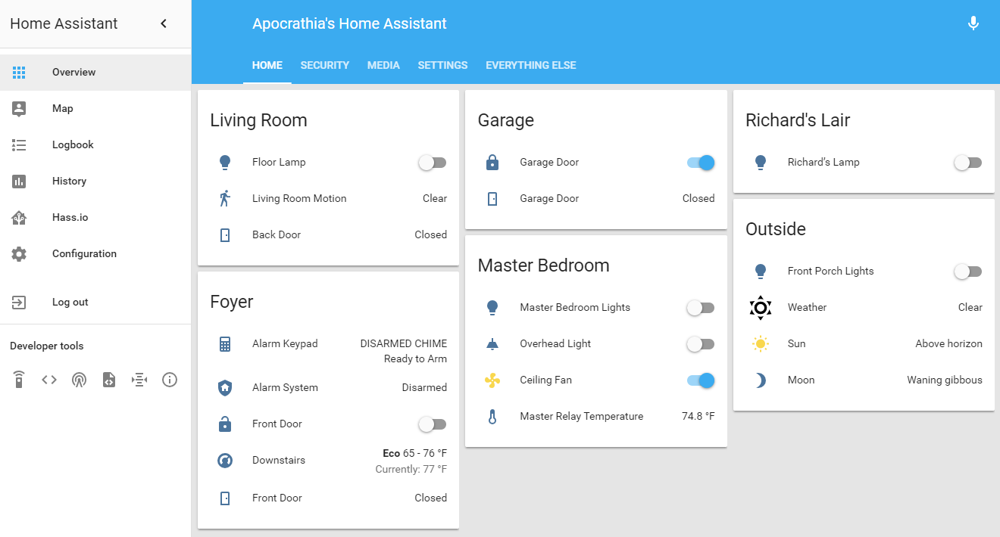

# Apocrathia's Home Assistant Configuration Files 

This is something that I've been meaning to get setup for a while now.
I am referencing [shortbloke](https://github.com/shortbloke/home_assistant_config)'s repository for a lot of this, as I really appcreciate the organization that he has come up with for all of this.

### Configuration File Status 
Each commit triggers a build check by TravisCI. If this is successful, my local HASS instance will automagically pull down the new configuration and restart itself.

## Hardware
I am running Home Assistant within Hass.io on a VMware Photon Virtual machine which is running within VMware ESXi on an Intel NUC. For the most part, I have attempted to abstract as much hardware from the equation as possible.

## More Information
(Coming soon!)

**Note: Private information is stored in secrets.yaml (not uploaded)**