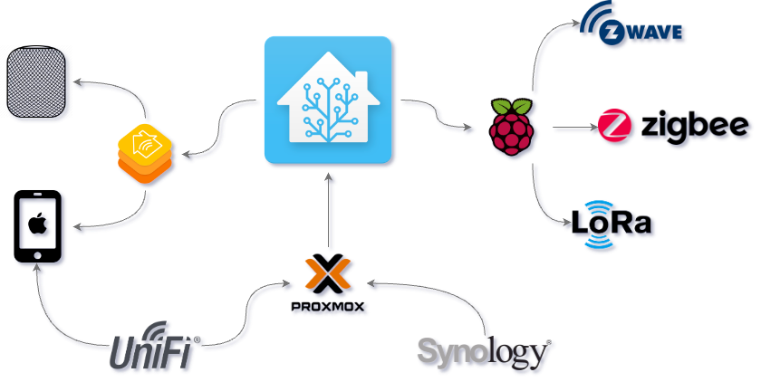

# Apocrathia's Home Assistant Configuration Files

![Project Maintenance][maintenance-shield]
[![License][license-shield]](LICENSE.md)

[![GitHub Activity][commits-shield]][commits]
[![GitHub Last Commit][last-commit-shield]][commits]

[![GitHub Actions][actions-shield]][actions]

![GitHub Stars][stars-shield]
![GitHub Watchers][watchers-shield]
![GitHub Forks][forks-shield]

[![Discord][discord-shield]][discord]
[![Community Forum][forum-shield]][forum]

---

## Architecture

The production instance of Home Assistant is running via the
[Home Assistant Operating System](https://github.com/home-assistant/operating-system)
on an old MacBook Pro, with a remote instance
running on another old MacBook Pro which has multiple USB radios connected
(Currently [Zigbee](https://www.home-assistant.io/integrations/zha/),
[Z-Wave](https://www.home-assistant.io/integrations/zwave_js/), and an
RTL-SDR dongle for [433mhz devices](https://github.com/merbanan/rtl_433)).

This is done for multiple reasons:

- Allow HA to communicate directly with wireless devices without the need for an external hub.
- Prevent having to pass USB devices through to virtual machines.
- Enable VMware to migrate the main HA VM across hosts within the cluster based upon load.
- Place radios in a more central location with better reception.

### Update 20230518

This is pending a refresh. The following tasks are planned:

- Migrate back to a VM. (However, I have converted all of my VMware hosts to Proxmox.)
- Migrate radios to strategically placed Raspberry Pi's. (Host management is the issue there. I haven't figured out what OS or)

Instances are linked together using
[Lukas Hetzenecker's home-assistant-remote custom_component](https://github.com/lukas-hetzenecker/home-assistant-remote),
which allows for all configuration to be completed within Home Assistant,
without the need to worry about using USB/IP or socat to push the devices over the network.
I've looked into using MQTT discovery, but the issue is advertisement intervals.
Devices show up instantly with the homeassistant-remote component, even after restarts.

## General Information

This configuration controls a couple of significant features in my smart home.

- Alarm Clock using my bedroom lights and TV
- Turning on/off lights at sunset/sunrise
- Arming the alarm system when nobody is home
- Security lighting when motion is detected at my front door

**Note: Private information is stored in secrets.yaml (not uploaded)**

[commits-shield]: https://img.shields.io/github/commit-activity/y/Apocrathia/home-assistant-config.svg
[commits]: https://github.com/Apocrathia/home-assistant-config/commits/master
[actions-shield]: https://github.com/Apocrathia/home-assistant-config/workflows/Home%20Assistant%20CI/badge.svg
[actions]: https://github.com/Apocrathia/home-assistant-config/actions
[contributors]: https://github.com/Apocrathia/home-assistant-config/graphs/contributors
[discord-shield]: https://img.shields.io/discord/330944238910963714.svg
[discord]: https://discord.gg/c5DvZ4e
[forum-shield]: https://img.shields.io/badge/community-forum-brightgreen.svg
[forum]: https://community.home-assistant.io/?u=Apocrathia
[apocrathia]: https://github.com/Apocrathia
[home-assistant]: https://home-assistant.io
[issue]: https://github.com/Apocrathia/home-assistant-config/issues
[license-shield]: https://img.shields.io/badge/license-apache-brightgreen.svg
[maintenance-shield]: https://img.shields.io/maintenance/yes/2023.svg
[last-commit-shield]: https://img.shields.io/github/last-commit/Apocrathia/home-assistant-config.svg
[stars-shield]: https://img.shields.io/github/stars/Apocrathia/home-assistant-config.svg?style=social&label=Stars
[forks-shield]: https://img.shields.io/github/forks/Apocrathia/home-assistant-config.svg?style=social&label=Forks
[watchers-shield]: https://img.shields.io/github/watchers/Apocrathia/home-assistant-config.svg?style=social&label=Watchers
